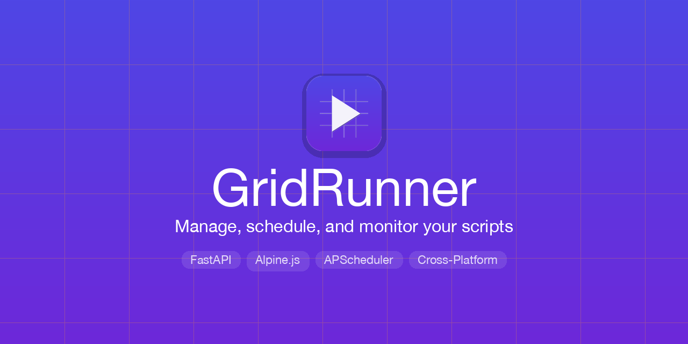

<p align="center">
  
</p>

<p align="center">
  <strong>Manage, schedule, and monitor your scripts from a native desktop app.</strong>
</p>

<p align="center">
  <a href="#features">Features</a> &bull;
  <a href="#installation">Installation</a> &bull;
  <a href="#usage">Usage</a> &bull;
  <a href="#supported-languages">Languages</a> &bull;
  <a href="#building">Building</a> &bull;
  <a href="#configuration">Configuration</a>
</p>

---

GridRunner is a cross-platform desktop application for managing, scheduling, and monitoring scripts on your local machine. It wraps a FastAPI backend with an Alpine.js frontend inside a native OS webview window — no browser required.

## Features

- **Script Management** — Add scripts via file browser or path, organize into color-coded categories, and run them with one click
- **18 Script Types** — Python, Bash, Zsh, Node.js, Ruby, Perl, PHP, Go, Swift, Java, R, Julia, Deno, Lua, PowerShell, Shell (sh), executables, and custom
- **Scheduling** — Interval-based, cron expressions, or specific times with day-of-week selection
- **Runtime Discovery** — Automatically detects installed interpreters (pyenv, nvm, Homebrew, rbenv, system) with version info
- **Python venv Support** — Create virtual environments, manage packages, and run scripts in isolated venvs
- **Dependency Checks** — Validate interpreter availability, script paths, and venv configuration before saving
- **Run History** — Full execution logs with stdout/stderr capture and real-time streaming output (SSE)
- **Dashboard** — Live stats, currently running scripts, upcoming schedules, recent failures
- **Notifications** — Email (SMTP) and webhook notifications on script completion or failure
- **Cron Import** — Parse your system crontab and import jobs directly into GridRunner
- **Backup & Restore** — Export and import your full configuration as JSON
- **Dark Mode** — Toggle between light and dark themes
- **Authentication** — Optional password protection (disabled by default)

## Installation

### Download

Grab the latest release for your platform from the [Releases](https://github.com/rosscaleca/GridRunner/releases) page:

| Platform | Download |
|----------|----------|
| macOS    | `GridRunner-macos.zip` |
| Windows  | `GridRunner-windows.zip` |
| Linux    | `GridRunner-linux.zip` |

### From Source (uv)

[uv](https://docs.astral.sh/uv/) is the recommended way to run from source — no Python install required:

```bash
git clone https://github.com/rosscaleca/GridRunner.git
cd GridRunner
uv run run.py
```

`uv` will automatically download the correct Python version and install dependencies on first run.

<details>
<summary>Alternative: pip</summary>

```bash
git clone https://github.com/rosscaleca/GridRunner.git
cd GridRunner
python3 -m venv .venv
source .venv/bin/activate    # Windows: .venv\Scripts\activate
pip install .
python run.py
```

</details>

## Usage

### Desktop App

```bash
uv run run.py
```

This finds an available port, starts the FastAPI server in a background thread, and opens a native window via pywebview.

### Development Mode

Run in a browser with hot reload:

```bash
uv run uvicorn backend.main:app --host 127.0.0.1 --port 8420 --reload
```

Then open `http://127.0.0.1:8420` in your browser.

### With Authentication

```bash
GRIDRUNNER_AUTH_ENABLED=true uv run run.py
```

On first launch you'll be prompted to set a password.

## Supported Languages

| Type | Extensions | Interpreter |
|------|-----------|-------------|
| Python | `.py` | `python3` |
| Bash | `.sh`, `.bash` | `bash` |
| Zsh | `.zsh` | `zsh` |
| Shell | `.sh` | `sh` |
| Node.js | `.js`, `.mjs` | `node` |
| Ruby | `.rb` | `ruby` |
| Perl | `.pl` | `perl` |
| PHP | `.php` | `php` |
| Go | `.go` | `go run` |
| Swift | `.swift` | `swift` |
| Java | `.java` | `java` (JEP 330) |
| R | `.r`, `.R` | `Rscript` |
| Julia | `.jl` | `julia` |
| Deno | `.ts` | `deno run` |
| Lua | `.lua` | `lua` |
| PowerShell | `.ps1` | `pwsh` |
| Executable | any | direct execution |
| Other | any | custom interpreter |

GridRunner auto-detects the script type from the file extension when using the file browser.

## Testing

```bash
uv run pytest -v
```

66 tests covering script execution, runtime discovery, and scheduling.

## Building

GridRunner packages into native desktop executables via PyInstaller.

### macOS

```bash
bash build/build_macos.sh    # Output: dist/macos/GridRunner.app
```

### Linux

Requires `libwebkit2gtk-4.1-dev`:

```bash
bash build/build_linux.sh    # Output: dist/linux/GridRunner/
```

### Windows

```bash
build\build_windows.bat      # Output: dist\windows\GridRunner\GridRunner.exe
```

### Creating a Release

Tag and push to trigger the CI/CD pipeline:

```bash
git tag v1.x.0
git push origin v1.x.0
```

GitHub Actions will test, build for all platforms, and publish a release with platform-specific zip archives.

## Configuration

All environment variables use the `GRIDRUNNER_` prefix:

| Variable | Default | Description |
|----------|---------|-------------|
| `SECRET_KEY` | *(insecure default)* | Session signing key |
| `PORT` | `8420` | Server port (auto-assigned in desktop mode) |
| `HOST` | `127.0.0.1` | Bind address |
| `TIMEZONE` | `America/Los_Angeles` | Display timezone |
| `AUTH_ENABLED` | `false` | Enable password authentication |
| `DEFAULT_TIMEOUT` | `3600` | Script timeout in seconds |
| `MAX_CONCURRENT_RUNS` | `10` | Max parallel executions |

SMTP, digest, and notification settings are configured through the Settings page in the app and persist across restarts.

## Data Storage

All data is stored in `~/.gridrunner/`:

```
~/.gridrunner/
  gridrunner.db       # SQLite database
  logs/               # Rotating log files (5MB, 3 backups)
  backups/            # Configuration backups
```

## Architecture

```
run.py                  # Desktop entry: pywebview + uvicorn in daemon thread
backend/
  main.py               # FastAPI app with lifespan management
  config.py             # Pydantic settings (env vars)
  database.py           # SQLAlchemy async (SQLite)
  executor.py           # Subprocess execution with timeout/retry
  runtimes.py           # Interpreter discovery and caching
  scheduler.py          # APScheduler (AsyncIOScheduler)
  notifications.py      # Email (aiosmtplib) and webhooks
  api/                  # REST API routes
frontend/
  index.html            # Single-page app shell
  js/app.js             # Alpine.js components
  js/api.js             # API client
  js/alpine.min.js      # Bundled for offline use
  css/styles.css        # All styles, light/dark themes
build/
  gridrunner.spec       # PyInstaller configuration
  build_*.sh/.bat       # Platform build scripts
```

## Tech Stack

- **Backend:** Python, FastAPI, SQLAlchemy (async), APScheduler, Pydantic v2
- **Frontend:** Alpine.js 3, vanilla CSS (no build step)
- **Desktop:** pywebview (native OS webview)
- **Database:** SQLite via aiosqlite
- **Dev tooling:** [uv](https://docs.astral.sh/uv/) (dependency management, Python version management)
- **Packaging:** PyInstaller, GitHub Actions CI/CD
